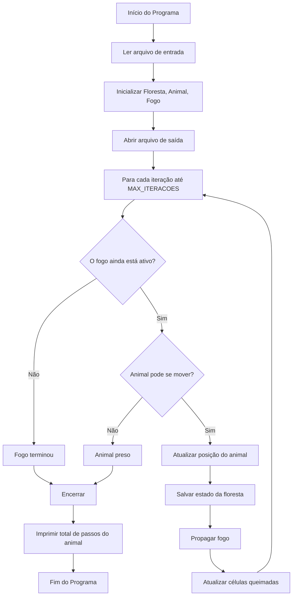

# Simulação de Propagação de Incêndios

<div style="display: inline-block;">
 
 
</a> 
</div>

<p align= "justify">
<p>
Este repositório é referente ao trabalho de aquecimento da disciplina <strong>Algoritmos e Estrutura de Dados I</strong>, ministrada pelo docente Michel Pires do Centro Federal de Educação Tecnológica de Minas Gerais (CEFET-MG).
</p>

# Sumário

- [Introdução e Objetivo](#introdução-e-objetivo)
- [Lógica de Desenvolvimento](#lógica-de-desenvolvimento)
- [Implementação](#implementação)  
- [Resultados](#resultados)
- [Compilação](#compilação)
- [Conclusão](#conclusão)
- [Referências](#referências)


# Introdução e Objetivo

O Trabalho de Aquecimento é um trabalho que tem por objetivo a implementação de um sistema de propagação de incêndios que percorre uma matriz e modifica suas células, enquanto um "animal" se movimenta com base em prioridades pré-definidas e procura ao máximo evitar as celulas "em chamas".

# Lógica de Desenvolvimento

A lógica da movimentação do animal é baseada em Algoritmo Guloso utilizando certas prioridades para verificar as vizinhanças e realizar as movimentações, enquanto o fogo se propaga utilizando Vizinhança de Von Neumann.

### Busca Local Gulosa

Na movimentação do animal foi implementada uma espécie de busca local baseada em Algoritmo Guloso, onde as celulas ortogonais ao animal são conferidas, armazenadas e então é tomado o primeiro movimento armazenado como o que será utilizado. Essa seleção de movimentos possíveis é feita com base nas prioridades 
definidas no documento '[pratica.pdf](./pratica.pdf)'.

### Vizinhança de Von Neumann

A propagação do fogo é baseada na Vizinhança de Von Neumann, que verifica as quatro células ortogonais ao foco do incêndio e inicia sua propagação.

# Implementação

Aqui abordaremos as funções e implementações principais do código.

## Fluxograma da Simulação




### Leitura de Arquivo

O input possui, em sua primeira linha, o número de linhas e colunas da matriz, onde está o foco inicial do incêndio e a posição inicial do animal. A primeira linha é lida, e seus componentes são armazenados na seguinte ordem: **arquivo > linhas > colunas > focoInicialX > focoInicialY > posInicialAnimalX > posInicialAnimalY**; então dois fors geram a matriz baseados nos componentes linhas e colunas. Após isso, a célula da matriz onde o foco do incêndio se inicia é transformada em 2, baseando-se nas componentes posInicialAnimalX e posInicialAnimalY.
[https://github.com/JoaoAnt0nio/Trabalho-Aquecimento/blob/main/src/Floresta.cpp#L30](https://github.com/JoaoAnt0nio/Trabalho-Aquecimento/blob/main/src/Floresta.cpp#L30
)

### Movimentação do Animal

O algoritmo verifica as células ortogonaisw e toma a decisão de se movimentar com base nas seguintes prioridades:

*1 -* Caminhos seguros são células de valor 0 (área vazia que não queima), 1 (árvore saudável), 3 (árvore carbonizada) ou 4 (área com presença de água), seguindo a seguinte hierarquia: 4 > 0 || 1 > 3;  
  
*2 -* Caminho inseguro é uma celula de valor 2 (árvore em chamas) que não deve ser visitada.

| Tipo de célula | Valor            | Prioridade |
|------------------|------------------------|-------------|
| Água | 4  | 1(melhor)|
| Espaço vazio | 0 | 2 |
| Árvores| 1 | 3 |
| Árvores queimadas| 3 | 4 |
| Árvores em chamas| 2 | 5(evitado) |

#### Função Mover

A função `Mover` faz o animal se movimentar, escolhendo sempre células 4 ou o primeiro caminho armazenado em caso de células 0, 1 ou 3. Além disso, o animal permanece imóvel por até 3 iterações quando encontra uma célula de valor 0. Esta função
possui custo computacional **O(1)**. 

#### Função transformarCelulasAoRedorDaAgua

A função `transformarCelulasAoRedorDaAgua` transforma a célula 4 em 0 e as células ortogonais a 4 em 1, baseando-se em 4 'ifs' diferentes que alteram o valor destas células ortogonais. 

### Propagaçao do Fogo

#### Função Propagar

A função `Propagar` percorre a matriz usando dois 'for' simples, identifica células de valor 2 e então verifica ortogonalmente estas células de valor 2; após isso, as células de valor 1 ortogonais a 2 são armazenadas utilizando um vetor de pares inteiros; após serem armazenadas, um contador é atribuido a cada célula separadamente utilizando `map<pair<int, int>, int> contadorQueima`, este contador nos permite transformar as células 1 em 2, e 2 em 3 da maneira solicitada no documento '[pratica.pdf](./pratica.pdf)'. Esta função tem custo computacional **O(n × m)**.

### Configurações 

#### Direções do Vento

Foi criado um booleano `COM_VENTO` que, quando ativado nos permite ativar outros 4 booleanos (`VENTO_CIMA`, `VENTO_BAIXO`, `VENTO_DIREITA`, `VENTO_ESQUERDA`), que direcionam a maneira com que o fogo se propaga. Caso ativados, estes booleanos retornam 0 ou um valor especifico. Por exemplo, `VENTO_CIMA` retorna -1 caso ativado e 0 caso desativado.

```
bool COM_VENTO = false;
bool VENTO_CIMA = false;
bool VENTO_BAIXO = false;
bool VENTO_ESQUERDA = false;
bool VENTO_DIREITA = false;
```
```
int dx[] = {config.vento_cima(), config.vento_baixo(), 0, 0};
int dy[] = {0, 0, config.vento_esquerda(), config.vento_direita()}
```

# Resultados

### Matriz Utilizada

Os resultados são baseados na seguinte matriz 10x10:

```
1 0 0 1 4 1 0 1 4 1     
1 1 1 4 1 0 1 1 4 1     
1 1 1 1 1 4 0 1 1 0     
0 0 1 0 1 1 1 4 1 0     
1 1 1 1 1 0 0 1 0 4     
1 1 1 1 4 0 1 1 1 1     
0 1 1 1 1 1 1 1 1 1    
1 1 1 1 1 4 0 1 4 0     
0 1 0 0 1 1 0 1 1 0     
0 1 1 1 1 0 1 1 4 1
```
### Primeiro Caso Teste

O output completo pode ser visto em [Caso Teste 1](CasosTeste/CasoTeste1).

O primeiro caso teste inicia o foco do incêndio na posição 5x5 da matriz e o animal inicia na posição 3x3, a iteração final se dá da seguinte maneira:

```
Iteração 12:

O animal está parado em uma célula zero

Posição do animal: (0, 4)

2 0 0 1 0 1 0 1 4 1 
2 3 3 0 3 0 1 1 4 1 
3 3 3 3 3 4 0 1 1 0 
0 0 3 0 3 3 3 4 1 0 
3 3 3 3 3 0 0 3 0 4 
3 3 3 3 4 3 3 3 3 3 
0 3 3 3 3 3 3 3 3 3 
3 3 3 3 3 4 0 3 4 0 
0 3 0 0 3 3 0 3 3 0 
0 3 3 3 3 0 3 3 4 1 

---------------------------------------------
Fogo parou de se propagar na iteração: 12

Número total de passos: 3

Simulação terminada porque o fogo não pode mais se propagar.
```
### Segundo Caso Teste

O output completo pode ser visto em [Caso Teste 2](CasosTeste/CasoTeste2)


O segundo caso teste inicia o foco do incêndio na posição 9x7 da matriz e o animal inicia na posição 0x0, a iteração final se dá da seguinte maneira:

```
Iteração 16:

Posição do animal: (0, 1)

2 0 0 1 4 1 0 1 4 1 
2 3 3 4 3 0 1 1 4 1 
3 3 3 3 3 4 0 1 1 0 
0 0 3 0 3 3 3 4 1 0 
3 3 3 3 3 0 0 3 0 4 
3 3 3 3 4 0 3 3 3 3 
0 3 3 3 3 3 3 3 3 3 
3 3 3 3 3 4 0 3 4 0 
0 3 0 0 3 3 0 3 3 0 
0 3 3 3 3 0 3 3 4 1 

---------------------------------------------
Fogo parou de se propagar na iteração: 16

Número total de passos: 16

Simulação terminada porque o fogo não pode mais se propagar.
```

### Terceiro Caso Teste

O output completo pode ser visto em [Caso Teste 3](CasosTeste/CasoTeste3)


O terceiro caso teste é um pouco diferente, aqui alterei a matriz inicial e cerquei o animal com celulas em chamas para podermos verificar o comportamento do código quando o animal não não consegue se mover.

Abaixo a matriz alterada, com o foco se iniciando em 0x0 e o animal começando na em 1x1:

```
1 1 1 1 4 1 0 1 4 1     
2 1 2 4 1 0 1 1 4 1     
2 2 2 1 1 4 0 1 1 0     
0 0 1 0 1 1 1 4 1 0     
1 1 1 1 1 0 0 1 0 4     
1 1 1 1 4 0 1 1 1 1     
0 1 1 1 1 1 1 1 1 1    
1 1 1 1 1 4 0 1 4 0     
0 1 0 0 1 1 0 1 1 0     
0 1 1 1 1 0 1 1 4 1
```
Iteração final abaixo:

```
Iteração 1:

Posição do animal: (0, 1)

2 2 2 1 4 1 0 1 4 1 
2 2 2 4 1 0 1 1 4 1 
2 2 2 2 1 4 0 1 1 0 
0 0 2 0 1 1 1 4 1 0 
1 1 1 1 1 0 0 1 0 4 
1 1 1 1 4 0 1 1 1 1 
0 1 1 1 1 1 1 1 1 1 
1 1 1 1 1 4 0 1 4 0 
0 1 0 0 1 1 0 1 1 0 
0 1 1 1 1 0 1 1 4 1 

---------------------------------------------
Animal ficou sem saída na iteração: 1

Número total de passos: 0
```
### Análise dos Resultados

Os resultados expostos indicam que o código cumpre consistentemente os requisitos propostos pelo professor, apresentando sempre o mesmo padrão de propagação e com o animal se movimentando coerentemente de acordo com os requisitos pré-estabelecidos no documento '[pratica.pdf](./pratica.pdf)'. O algoritmo suporta matrizes de tamanhos relevantes, porém inevitavelmente perde desempenho de maneira exponencial à medida que o tamanho das matrizes e o número de iterações aumentam.

# Compilação


Para compilar e rodar o código usando MakeFile, basta seguir os seguintes comandos.
| Comando                |  Função                                                                                               |                     
| -----------------------| ------------------------------------------------------------------------------------------------------|
|  make clean          | Apaga a última compilação realizada contida na pasta build                                            |
|  make                | Executa a compilação do programa utilizando o gcc, e o resultado vai para a pasta build               |
|  make run            | Executa o programa da pasta build após a realização da compilação                                     |
|make r| Faz os três processos descritos acima em apenas um comando|

# Conclusão

Ao longo do projeto, foi possível modelar a evolução do fogo em uma matriz, incorporando regras de propagação com e sem influência do vento, bem como a movimentação de um animal que busca rotas de fuga seguras. A implementação dessas funcionalidades exigiu uma análise cuidadosa das estruturas de dados mais adequadas, culminando na utilização de matrizes dinâmicas para representar a floresta e variáveis externas para acompanhar a posição do animal. Além disso, o uso de arquivos de configuração (config.hpp) permitiu definir parâmetros globais, garantindo maior flexibilidade na simulação.

# Referências 

CORMEN, Thomas H.; LEISERSON, Charles E.; RIVEST, Ronald L.; STEIN, Clifford. Algoritmos: teoria e prática. 3. ed. Rio de Janeiro: Elsevier, 2012.
  
NEUMANN, John von. Theory of Self-Reproducing Automata. Editado e completado por Arthur W. Burks. Urbana: University of Illinois Press, 1966.

# Autor
<p>
  João Antônio Melo Zacarias - Graduando em Engenharia da Computação pelo <a href="https://www.cefetmg.br" target="_blank">CEFET-MG</a>. Contato: (<a href="mailto:joaoantmeloz@gmail.com">joaoantmeloz@gmail.com</a>)
</p>


